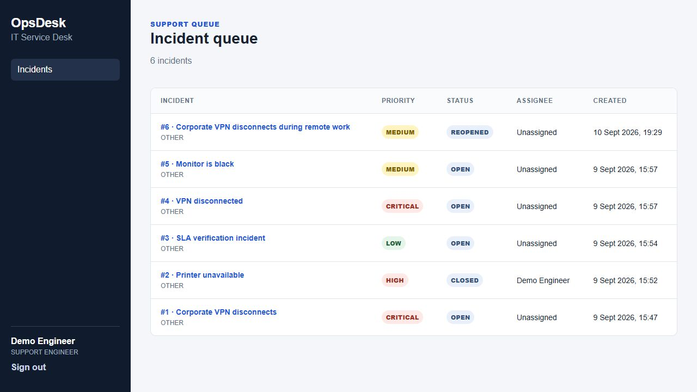
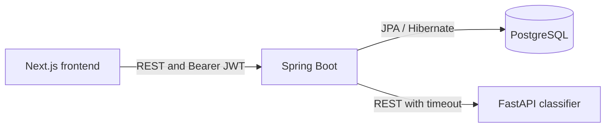

# OpsDesk AI

[](https://github.com/krishna-chandra-dolai/opsdesk-ai/actions/workflows/ci.yml)

An IT service desk platform with Java business rules and a separate Python category classifier. OpsDesk replaces fragmented incident reports with an auditable employee-to-engineer workflow.

**Current status: backend, classifier and Next.js MVP complete. DEPLOYMENT PENDING.**

Implemented: authentication, role authorization, incident workflow, comments, activity, SLA, real admin counts, FastAPI classification with fallback, one role-aware Next.js interface, Swagger/OpenAPI, Dockerfiles and GitHub Actions. Physical deployment is pending.

## Screenshots

Screenshots show the actual local application with demonstration data. See the [screenshot gallery](docs/screenshots/README.md).



## Stack and structure

Java 21, Spring Boot 3.5.16, Maven 3.9.11, PostgreSQL 17.11, Next.js 16.3.4, React 19.2.8, TypeScript 5.9.3, Python 3.11, FastAPI 0.141.1 and scikit-learn 1.9.0.

```text
backend/       Spring Boot application
ai-service/    TF-IDF/logistic-regression classifier
frontend/      Next.js App Router interface
docs/          Plan, architecture and interview revision
.github/       Build, test and container workflows
```



Spring Boot owns priority, workflow, authorization and persistence. Python only suggests a category. See [architecture](docs/architecture.md) and the [code walkthrough](docs/code-walkthrough.md).

## Local backend setup

Install Java 21, Maven 3.9.11 and PostgreSQL. Create two databases, `opsdesk` and `opsdesk_test`, owned by a local development role. Use a separate test database.

Export these environment variables in your shell:

```text
DB_HOST=localhost
DB_PORT=5432
DB_NAME=opsdesk
DB_USERNAME=<your development role>
DB_PASSWORD=<your local password>
TEST_DB_URL=jdbc:postgresql://localhost:5432/opsdesk_test
TEST_DB_USERNAME=<your test role>
TEST_DB_PASSWORD=<your local password>
JWT_SECRET=<at least 32 random bytes; never commit it>
JWT_EXPIRATION=3600
AI_SERVICE_URL=http://localhost:8000
AI_SERVICE_TIMEOUT_MS=1500
```

`.env.example` documents configuration; Spring does not automatically load a `.env` file. Never commit a real password. `SERVER_PORT` defaults to 8080.

From `backend/`:

```sh
mvn verify
mvn spring-boot:run
```

Or run the packaged application after verification:

```sh
java -jar target/opsdesk-backend-0.1.0-SNAPSHOT.jar
```

Check `GET http://localhost:8080/actuator/health`. Healthy response: `{"status":"UP"}`. Only health is exposed. A datasource connection failure prevents normal startup or makes health unavailable/unhealthy.

Swagger UI is available at `http://localhost:8080/swagger-ui/index.html`; its Authorize button accepts the JWT returned by login. The machine-readable contract is at `GET /v3/api-docs`. Registration and login are public even though protected endpoints use the global Bearer scheme.

Flyway creates the `users` table through `V1__create_users.sql`. Hibernate validates mappings instead of creating or updating production tables.

### Development demo accounts

Run with the `dev` profile to seed three accounts:

```sh
SPRING_PROFILES_ACTIVE=dev mvn spring-boot:run
```

| Email | Role | Development-only password |
| --- | --- | --- |
| `employee@opsdesk.demo` | EMPLOYEE | `DemoOnly123!` |
| `engineer@opsdesk.demo` | SUPPORT_ENGINEER | `DemoOnly123!` |
| `admin@opsdesk.demo` | ADMIN | `DemoOnly123!` |

The initializer is disabled unless explicitly enabled by the development profile. These credentials are examples for a local demonstration and must not be used in production.

### Authentication API

- `POST /api/auth/register` accepts `name`, `email`, and `password`; it always creates an EMPLOYEE.
- `POST /api/auth/login` returns a signed Bearer token and the safe user response.
- `GET /api/users/me` requires a valid Bearer token.
- `GET /api/users` is paged and restricted to ADMIN.

### Incident API

- `POST /api/incidents`, `GET /api/incidents`, `GET /api/incidents/{id}`
- `PATCH /api/incidents/{id}/assign`, `PATCH /api/incidents/{id}/status`
- `POST|GET /api/incidents/{id}/comments`, `GET /api/incidents/{id}/activity`
- `GET /api/admin/summary`

Priority is calculated from impact and urgency. The explicit lifecycle is OPEN → ASSIGNED → IN_PROGRESS → RESOLVED → CLOSED, with RESOLVED → REOPENED and then reassignment or IN_PROGRESS. Unsupported transitions return 400.

SLA targets are CRITICAL 2h, HIGH 4h, MEDIUM 8h and LOW 24h. A scheduled check marks unresolved overdue incidents once and records `SLA_BREACHED`.

## AI service

From `ai-service/`, create a virtual environment and install `requirements-dev.txt`, then run:

```sh
python train.py
python -m pytest -q
python -m uvicorn app:app --port 8000
```

`GET /health` and `POST /predict` are available. The Java backend calls `/predict` before its database transaction with a 1.5-second default timeout. If the call fails, the incident is still saved with null AI fields.

The proof-of-concept dataset contains 48 explicitly synthetic examples. With the fixed 75/25 stratified split and random state 42, the measured 12-row test result is accuracy 0.5833 and macro F1 0.5833. This limited result is not evidence of production model quality.

## Frontend

From `frontend/`:

```sh
npm ci
npm run typecheck
npm run lint
npm run build
npm run dev
```

Set `NEXT_PUBLIC_API_URL=http://localhost:8080` when the backend uses its default port. The application includes login/register, role-aware incident lists, employee creation, incident detail with comments/activity, engineer workflow actions, admin assignment and the database-backed admin summary.

The MVP stores its Bearer token in `localStorage`. This is easy to understand and works for a separate frontend/backend deployment, but JavaScript can read it if an XSS bug exists. A production evolution would use short-lived access tokens with a secure HttpOnly refresh cookie and a stricter content-security policy. Backend authorization remains authoritative.

Passwords are BCrypt hashes and never appear in API responses. Missing, invalid, and expired tokens return 401. An authenticated user without the required role receives 403. JWT signing material comes only from `JWT_SECRET`.

## Tests

`mvn verify` currently runs 24 Java tests. `python -m pytest -q` runs two AI tests. PostgreSQL must be running for Java integration tests. The integration tests explicitly cover validation, malformed enum input, missing resources, invalid transitions, unauthorized reassignment, and 401/403 response shapes.

## Remaining delivery

The [CI workflow](.github/workflows/ci.yml) runs backend tests against PostgreSQL, Python tests, frontend checks and three container builds. See [deployment instructions](docs/deployment.md) for environment variables, health checks and hosting steps. Physical hosting remains pending; deployment success is not claimed.

Revision guides: [interview notes](docs/interview-notes.md), [code walkthrough](docs/code-walkthrough.md).
